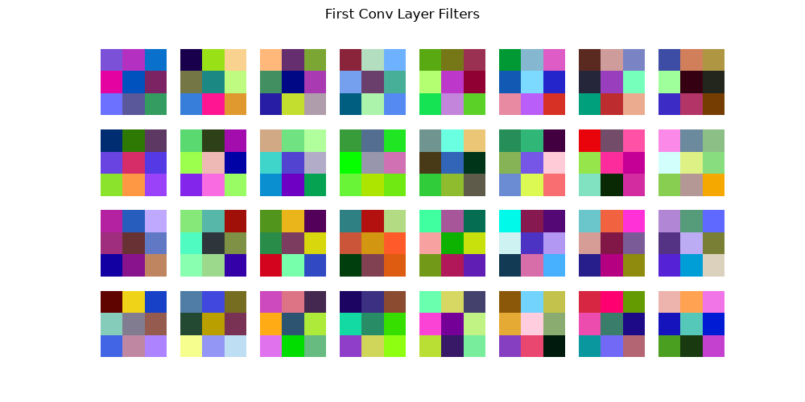
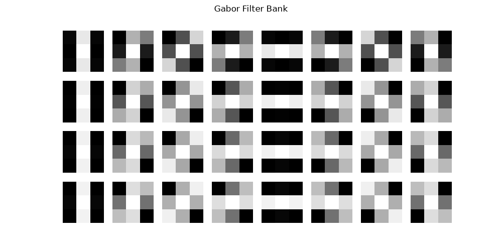

# cnn-image-classifier-scratch
# CNN Image Classifier from Scratch — Learned vs. Gabor Filters

A CNN built from scratch (no pretrained backbone) to classify CIFAR-10 images,
with an experiment comparing learned first-layer filters against classical
hand-designed Gabor filters.

## What this does
- Trains a 3-layer CNN on CIFAR-10 from scratch
- Builds a second variant where the first conv layer uses a fixed bank of
  Gabor filters (frozen, not learned) instead of randomly-initialized weights
- Compares test accuracy and visualizes both filter sets side by side

## Results

| Model              | Test Accuracy |
|---------------------|---------------|
| Learned CNN         | 59.80%        |
| Gabor-filter CNN     | 43.80%        |

The learned filters outperform the fixed Gabor filters by ~16 points. This
matches a known pattern in computer vision: hand-designed features (Gabor,
SIFT, HOG) were the standard before deep learning, but learned filters adapt
specifically to the task and generally outperform them once there's enough
data — part of why CNNs replaced classical feature engineering.

Note: trained on a 5,000-image subset of CIFAR-10 (not the full 50,000) for
faster CPU training, and only 10 epochs — accuracy would improve with the
full dataset and longer training.

## Filter visualizations

**Learned first-layer filters:**


**Gabor filter bank:**


## Project structure

cnn-image-classifier-scratch/
├── data.py # CIFAR-10 loading and preprocessing
├── model.py # Standard CNN (learned filters)
├── model_gabor.py # CNN variant with frozen Gabor first layer
├── gabor_filters.py # Generates the Gabor filter bank
├── train.py # Trains the standard CNN
├── train_gabor.py # Trains the Gabor-filter CNN
├── evaluate.py # Evaluation + learned filter visualization
├── requirements.txt
└── README.md


## How to run
```bash
pip install -r requirements.txt
python train.py           # trains standard CNN
python evaluate.py        # evaluates + visualizes learned filters
python train_gabor.py     # trains Gabor-filter CNN
```

## Background
Built as part of my M.Sc. AI Engineering of Autonomous Systems coursework at
THI Ingolstadt (Machine Perception and Cognition), which covered both CNNs
and Gabor filters as feature extraction methods.
